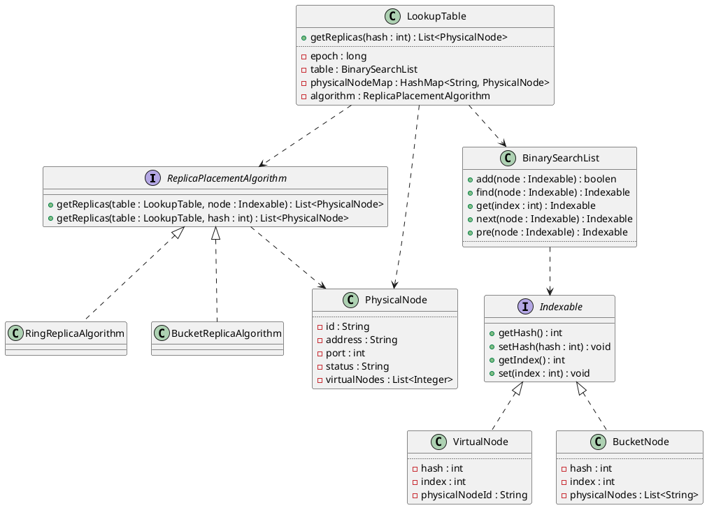

# Class Diagram

```plantuml

@startuml
ReplicaPlacementAlgorithm <|.. RingReplicaAlgorithm
ReplicaPlacementAlgorithm <|.. BucketReplicaAlgorithm
ReplicaPlacementAlgorithm ..> PhysicalNode

Indexable <|.. VirtualNode
Indexable <|.. BucketNode

BinarySearchList ..> Indexable

LookupTable ..> BinarySearchList
LookupTable ..> ReplicaPlacementAlgorithm
LookupTable ..> PhysicalNode

interface Indexable {
    + getHash() : int
    + setHash(hash : int) : void
    + getIndex() : int
    + set(index : int) : void
}

interface ReplicaPlacementAlgorithm {
    + getReplicas(table : LookupTable, node : Indexable) : List<PhysicalNode>
    + getReplicas(table : LookupTable, hash : int) : List<PhysicalNode>
}

class BinarySearchList {
    + add(node : Indexable) : boolen
    + find(node : Indexable) : Indexable
    + get(index : int) : Indexable
    + next(node : Indexable) : Indexable
    + pre(node : Indexable) : Indexable
    ....
}

class VirtualNode {
    ....
    - hash : int
    - index : int
    - physicalNodeId : String
}

class PhysicalNode {
    ....
    - id : String
    - address : String
    - port : int
    - status : String
    - virtualNodes : List<Integer>
}

class BucketNode {
    ....
    - hash : int
    - index : int
    - physicalNodes : List<String>
}

class LookupTable {
    + getReplicas(hash : int) : List<PhysicalNode>
    ....
    - epoch : long
    - table : BinarySearchList
    - physicalNodeMap : HashMap<String, PhysicalNode>
    - algorithm : ReplicaPlacementAlgorithm
}

@enduml

```
